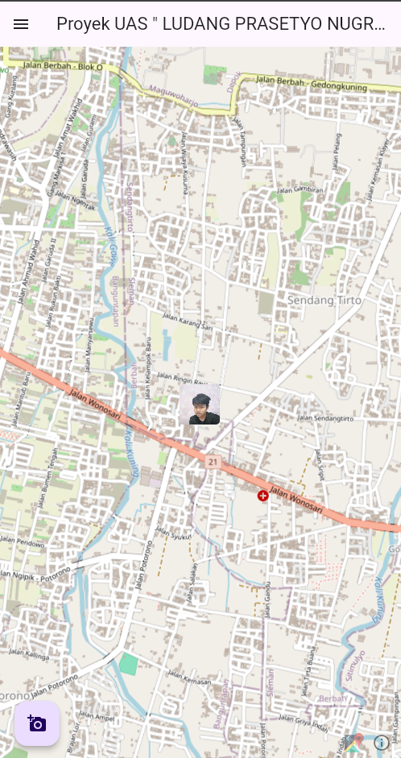
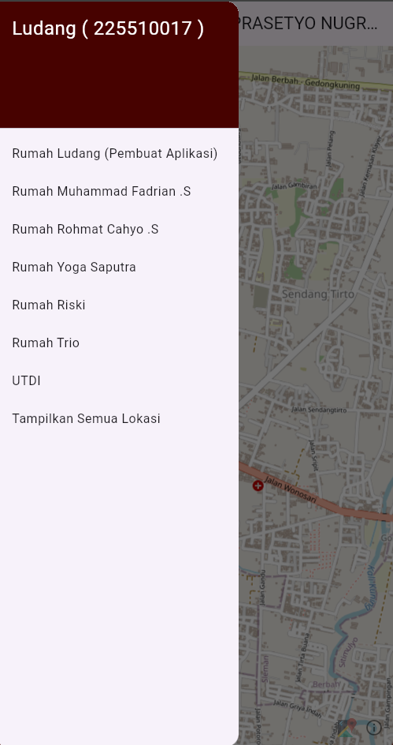
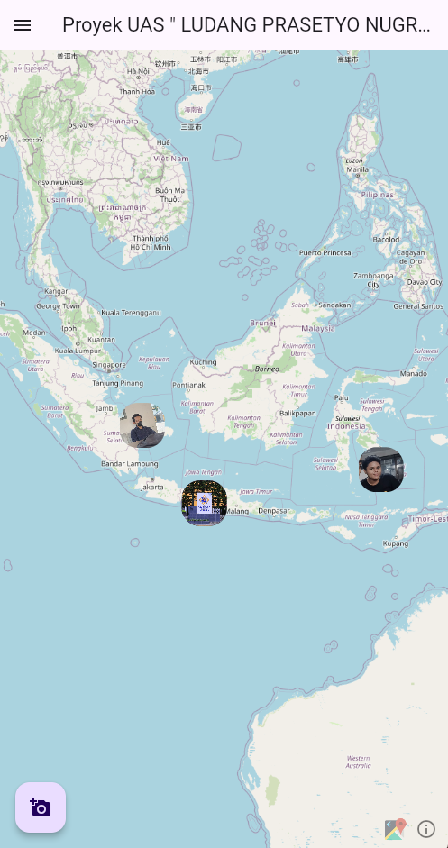

# Flutter Map Lokaisi ( By.Ludang )

```
# ------------------------------ #
#       Pembuat Proyek           #
#   > Ludang prasetyo .N         #
#   > Teknik Komputer S1         #
#   > 225510017                  #
#                                #
# ------------------------------ #
```
<h1 align="center">UI</h1>
<!-- Gambar 1 -->
<p align="center">
  
  
  
</p>

# Menjalankan aplikasi 
```
flutter run -v
```

# Pengertian code
```

 import 'package:latlong2/latlong.dart';                         <<<  Import dart
                                                                 
 final LatLng ludangLocation = LatLng(-7.820680, 110.426558);    <<< Memasukan kordinat lokai 
 const String ludangName = "Rumah Ludang (Pembuat Aplikasi)";    <<< Menampilkan nama 
 const String ludangImagePath = 'assets/ludang.jpg';             <<< Menambahkan Foto 

```

# Yaml

```
name:  Ludang_Proyek_UAS_Pemrograman_Mobile  
# ------------------
description: A new Flutter project.
publish_to: 'none' 
version: 1.0.0+1
  # ------------- !! Databes MySql !! ------------- #
  # dependencies:
  # flutter:
  #   sdk: flutter
  # mysql1: ^0.23.0
  # ------------- !! Databes MySql !! ------------- #
environment:
  sdk: ">=2.12.0 <3.0.0"
dependencies:
  flutter:
    sdk: flutter
  flutter_map: ^7.0.0
# ---------------------
  # flutter_radar: ^3.9.1
  # flutter_map: ^0.14.2
  # latlong: ^1.0.2
# --------------------
  image_picker: ^0.8.4+4
dev_dependencies:
  flutter_test:
    sdk: flutter
# --------------------
flutter:
  uses-material-design: true
  assets:
    # --------------  Foto yang di simpan di assets  -------------- # 
    - assets/rohmat.jpg
    - assets/ludang.jpg
    - assets/fadrian.jpg
    - assets/yoga.jpg
    - assets/riski.jpg
    - assets/trio.jpg
    - assets/utdi.jpg
    # --------------  Bila semua folder data di assets  -------------- # 
    # - assets/locations/ludang.dart
    # - assets/locations/fadrian.dart
    # - assets/locations/rohmat.dart
    # - assets/locations/yoga.dart
    # - assets/locations/riski.dart
    # - assets/locations/trio.dart
    # - assets/locations/utdi.dart


```
# Dart
```
// Import Paket
import 'dart:async';
import 'dart:io';
import 'package:flutter/material.dart';
import 'package:image_picker/image_picker.dart';
import 'package:flutter_map/flutter_map.dart';
import 'package:latlong2/latlong.dart';
// Import fils Data lokasi
import 'locations/ludang.dart';
import 'locations/fadrian.dart';
import 'locations/rohmat.dart';
import 'locations/yoga.dart';
import 'locations/riski.dart';
import 'locations/trio.dart';
import 'locations/utdi.dart';

// --------------------
// Membuat Apps
void main() => runApp(MyApp());

class MyApp extends StatelessWidget {
  const MyApp({Key? key}) : super(key: key);

  @override
  Widget build(BuildContext context) {
    return MaterialApp(
      debugShowCheckedModeBanner: false,
      home: HomeScreen(),
    );
  }
}

class HomeScreen extends StatefulWidget {
  @override
  State<HomeScreen> createState() => HomeScreenState();
}

// -------------------- Mengambil Kordinat lokasi

class HomeScreenState extends State<HomeScreen> {
  final List<LatLng> _locations = [
    ludangLocation,
    fadrianLocation,
    rohmatLocation,
    yogaLocation,
    riskiLocation,
    trioLocation,
    utdiLocation,
  ];

// -------------------- Mengambil Nama

  final List<String> _names = [
    ludangName,
    fadrianName,
    rohmatName,
    yogaName,
    riskiName,
    trioName,
    utdiName,
  ];

// -------------------- Mengambil Image foto

  final List<String> _imagePaths = [
    ludangImagePath,
    fadrianImagePath,
    rohmatImagePath,
    yogaImagePath,
    riskiImagePath,
    trioImagePath,
    utdiImagePath,
  ];

// --------------------

  LatLng? _currentLocation;
  File? _image;
  late MapController _mapController;

  @override
  void initState() {
    super.initState();
    _mapController = MapController();
  }

  Future<void> _pickImage() async {
    final pickedFile =
        await ImagePicker().pickImage(source: ImageSource.gallery);
    if (pickedFile != null) {
      setState(() {
        _image = File(pickedFile.path);
      });
    }
  }

  void _onLocationButtonPressed(int index) {
    setState(() {
      _currentLocation = _locations[index];
      _mapController.move(
          _currentLocation!, 15.0); // memindahkan lokasi sesuwai tujuan
    });
    _showPopup(context, _names[index], _imagePaths[index]);
  }

  void _showPopup(BuildContext context, String name, String imagePath) {
    showDialog(
      context: context,
      builder: (BuildContext context) {
        return AlertDialog(
          title: Text(name),
          content: Column(
            mainAxisSize: MainAxisSize.min,
            children: [
              Image.asset(imagePath),
              SizedBox(height: 10),
              Text('Lokasi $name'),
            ],
          ),
          actions: [
            TextButton(
              onPressed: () {
                Navigator.of(context).pop();
              },
              child: Text('OK'),
            ),
          ],
        );
      },
    );
  }

  void _showAllLocations() {
    setState(() {
      _currentLocation = null;
    });
  }

  @override
  Widget build(BuildContext context) {
    return Scaffold(
      appBar: AppBar(
        title: Text('Proyek UAS " LUDANG PRASETYO NUGROHO ( 225510017 )"'),
      ),
      body: Stack(
        children: [
          FlutterMap(
            mapController: _mapController,
            options: MapOptions(
              initialCenter: _currentLocation ?? LatLng(-7.815000, 110.420000),
              initialZoom: 15.0,
            ),
            children: [
              TileLayer(
                urlTemplate:
                    'https://tile.openstreetmap.org/{z}/{x}/{y}.png', //
                userAgentPackageName: 'com.example.app',
              ),
              if (_currentLocation != null)
                MarkerLayer(
                  markers: [
                    Marker(
                      point: _currentLocation!,
                      width: 50,
                      height: 50,
                      child: GestureDetector(
                        onTap: () {
                          int index = _locations.indexOf(_currentLocation!);
                          _showPopup(
                              context, _names[index], _imagePaths[index]);
                        },
                        child: ClipRRect(
                          borderRadius: BorderRadius.circular(5),
                          child: Image(
                              image: AssetImage(_imagePaths[
                                  _locations.indexOf(_currentLocation!)])),
                        ),
                      ),
                    ),
                  ],
                ),
              if (_currentLocation == null)
                MarkerLayer(
                  markers: _locations.map((location) {
                    int index = _locations.indexOf(location);
                    return Marker(
                      point: location,
                      width: 50,
                      height: 50,
                      child: GestureDetector(
                        onTap: () {
                          _onLocationButtonPressed(
                              index); // Call function when marker is clicked
                        },
                        child: ClipRRect(
                          borderRadius: BorderRadius.circular(20),
                          child: Image(image: AssetImage(_imagePaths[index])),
                        ),
                      ),
                    );
                  }).toList(),
                ),
              RichAttributionWidget(
                attributions: [
                  TextSourceAttribution('OpenStreetMap contributors'), //
                ],
              ),
            ],
          ),
          Positioned(
            bottom: 20,
            left: 20,
            child: FloatingActionButton(
              onPressed: _pickImage,
              child: Icon(Icons.add_a_photo),
            ),
          ),
        ],
      ),
      drawer: Drawer(
        child: ListView(
          padding: EdgeInsets.zero,
          children: [
            DrawerHeader(
              decoration: BoxDecoration(
                color: Color.fromARGB(255, 71, 2, 0),
              ),
              child: Text(
                'Ludang ( 225510017 )',
                style: TextStyle(
                  color: Color.fromARGB(255, 255, 255, 255),
                  fontSize: 24,
                ),
              ),
            ),
            for (int i = 0; i < _names.length; i++)
              ListTile(
                title: Text(_names[i]),
                onTap: () {
                  Navigator.pop(context);
                  _onLocationButtonPressed(i);
                },
              ),
            ListTile(
              title: Text('Tampilkan Semua Lokasi'),
              onTap: () {
                Navigator.pop(context);
                _showAllLocations();
              },
            ),
          ],
        ),
      ),
    );
  }
```

<h1 align="center">Copyright</h1>
<h3 align="center"> <a herf="https://nugra.online/"> © 2024 Ludang prasetyo. All rights reserved.<a></h3>
